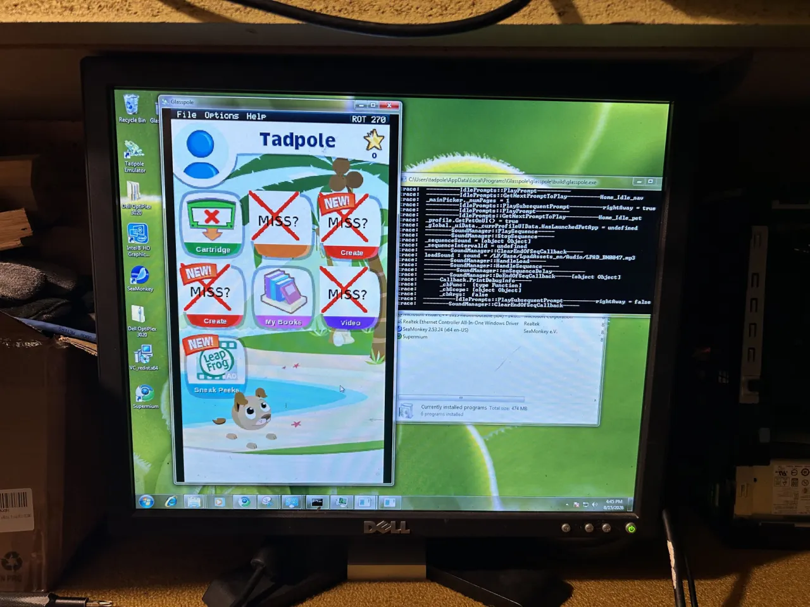
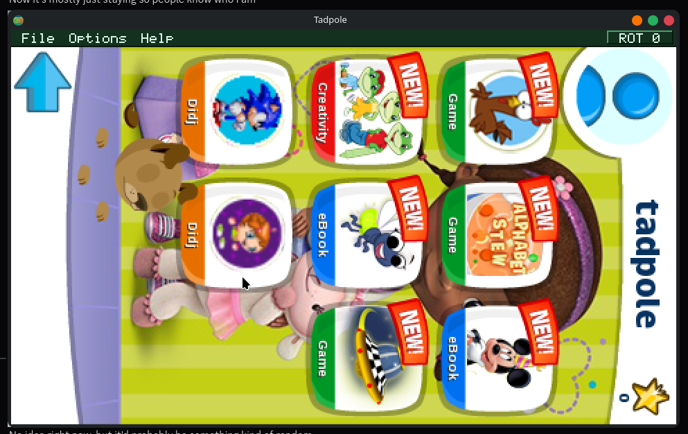
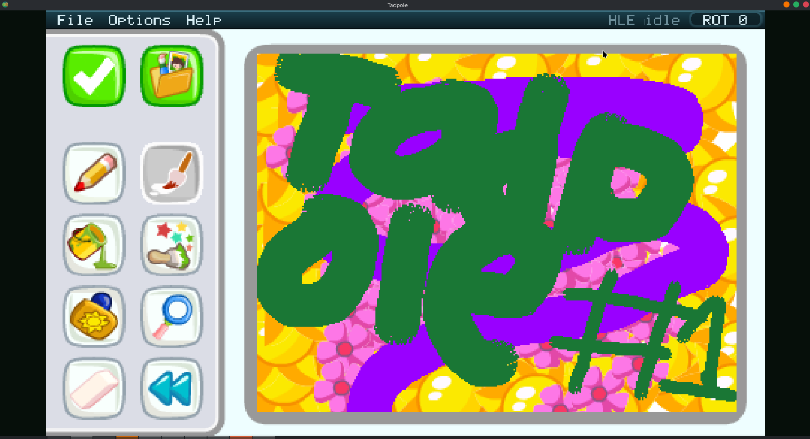
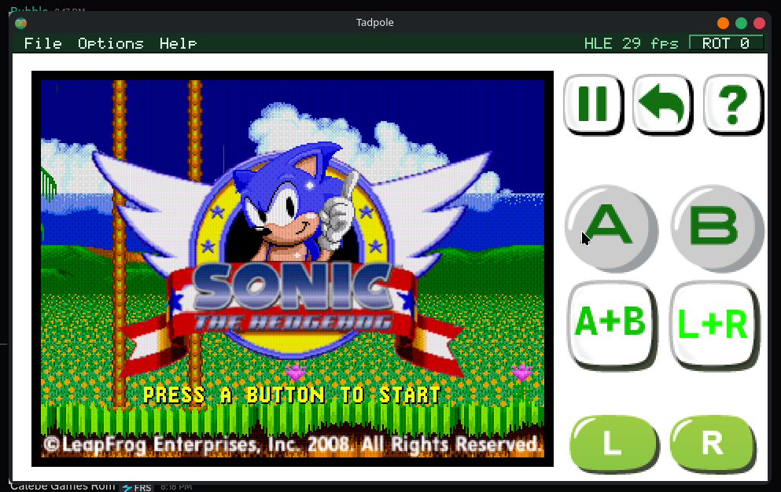
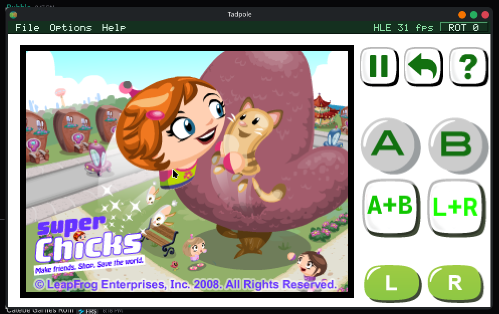

# Tadpole

A LeapPad2 emulator. It runs the real LeapFrog system software, the home
screen, the Flash titles and the native games, on a PC or a phone.

<p align="center">
  
</p>

<p align="center"><i>Tadpole on a Windows 7 machine. The home screen icons are
still a bit rough on Windows, but everything behind them works.</i></p>

Tadpole contains no LeapFrog code. You supply the system files and the games
from your own device. The setup wizard downloads the system files for you on
the first run, and the games come from your own cartridge backups.

## Where it runs

**Linux.** Download `Tadpole-x86_64.AppImage` from the
[releases page](https://github.com/BubbletopTag/tadpole/releases), make it
executable, run it. Nothing to install.

**Windows 7 and newer.** Download `Glasspole-Setup.exe` from the same page. It
installs per user, never asks for administrator, and puts a shortcut on the
desktop.

**Android 8 and newer.** There is a beta APK. On a 32-bit phone or tablet the
LeapPad software runs natively, with no emulator in the loop at all. On a
64-bit phone it runs through Glasspole. See `android/BETA.md` on the
`android` branch.

All three set themselves up on the first run: the wizard fetches the system
files, then you point it at your cartridge backups and pick what to install.

## What it looks like

<table>
  <tr>
    <td></td>
    <td></td>
  </tr>
  <tr>
    <td align="center"><i>The home screen, on Linux</i></td>
    <td align="center"><i>A painting app</i></td>
  </tr>
  <tr>
    <td></td>
    <td></td>
  </tr>
  <tr>
    <td align="center"><i>Sonic the Hedgehog (Didj)</i></td>
    <td align="center"><i>Super Chicks (Didj)</i></td>
  </tr>
</table>

Didj and Leapster titles run too. Rendering goes to your GPU, so games run at
the panel's full 60 Hz.

## Glasspole

Tadpole started out on Linux, running the LeapPad's ARM software under
`qemu-arm`. That meant there could never be a Windows version: QEMU's user-mode
emulation only exists on Linux hosts, and the QEMU project has no plans to
change that.

Glasspole is the answer. It is a from-scratch ARM Linux user-mode emulator:
[dynarmic](https://github.com/merryhime/dynarmic) does the CPU, and everything
else, the ELF loader, threads, futexes, memory mapping and the 51 syscalls the
LeapPad software actually uses, is written here against a small host interface
that Windows can satisfy. It runs on Windows 7 because it was designed to from
the first line.

Claude wrote it. The first commit, AppManager booting, the home screen
drawing, and the Windows backend running both guests all happened on 9 August
2026, in one day. I had written off a Windows version as impossible. Watching
Claude build a working ARM emulator from nothing in a single session is the
most impressive thing I have seen it do, and I still find it a bit hard to
believe.

It is now the default engine on Linux as well. A sweep of 110 titles puts it
level with `qemu-arm`, 85 launches to 82, and the bugs it has are ours to
fix. `qemu-arm` stays as the fallback and as the reference the sweep diffs
against.

## Controls

| Keyboard | |
|---|---|
| Arrow keys | D-pad |
| X / Z | A / B |
| Q / W | L / R |
| Home | Menu |
| Esc | Back |
| Mouse | stylus |
| - / = | volume |
| Ctrl+R | rotate |

A game controller works too. **Options → Controller Settings** shows the
mapping for the pad you have plugged in.

## Building from source

```sh
./tools/fetch-deps.sh          # qemu and the firmware tools
./tools/online-update.sh       # system files, straight from LeapFrog
cd tadpole && make all && cd ..
(cd glasspole && ./fetch-deps.sh && cmake -S . -B build -GNinja && ninja -C build)
./tadpole.sh --boot
```

`docs/MANUAL.md` has the full version: every dependency by distribution, the
firmware and game installers, cartridge dumps, settings, environment variables
and troubleshooting. `docs/HANDOVER.md` is the engineering notes.

## About the software you run on it

Tadpole reproduces the hardware. The firmware and the games are LeapFrog's, and
everything it runs comes from files you already have: the system files from
LeapFrog's own public update server, the games from your own cartridges.
Please keep it that way. No links to archives or vendor servers in issues or
pull requests.

## Licence

GPL. See `LICENSE`. Glasspole's dependency dynarmic is 0BSD.
